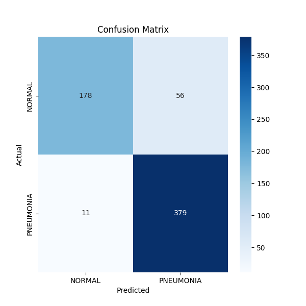

# Pneumonia Detection using CNN

## Overview
This project uses a custom Convolutional Neural Network (CNN) to detect pneumonia from chest X-ray images.

## Dataset
Chest X-ray dataset from Kaggle:
https://www.kaggle.com/datasets/paultimothymooney/chest-xray-pneumonia

## Features
- Custom CNN (no pretrained models)
- Data augmentation
- Regularization techniques
- Model evaluation

## Results
- Baseline accuracy: ~94% (train), ~62% (validation)
- Improved model: (update after training)

## How to Run
1. Download dataset from Kaggle
2. Place in `dataset/` folder
3. Run:

## Model Iterations

### Version 1
- Basic CNN
- High overfitting

### Version 2
- Added BatchNorm, Dropout
- Fixed evaluation using test set

### Version 3
- Applied class weighting
- Tuned decision threshold
- Improved confusion matrix performance

## Confusion Matrix

## Grad-CAM Visualization

The heatmap below shows the regions of the lungs the model focused on while predicting pneumonia.

